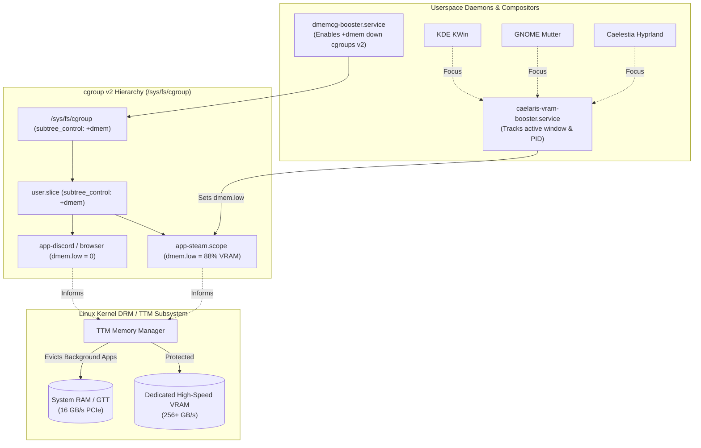

# Caelaris Linux — System Architecture & Technical Design

**Document Version:** 1.0-Rolling  
**Document Type:** System Architecture Specification  
**Target Platform:** x86_64 (UEFI & Legacy BIOS)  
**Base Distribution:** Arch Linux Rolling Baseline  
**Author:** Caelaris Core Architecture & Engineering Team  
**Last Updated:** September 2026  

---

## 1. High-Level Architectural Model

Caelaris Linux is organized into distinct, modular subsystem layers that separate base operating system packages, custom desktop environments, kernel/sysctl performance optimizations, and runtime installer automation:

```
+---------------------------------------------------------------------------------------+
|                                USER EXPERIENCE LAYER                                  |
|   KDE Plasma 6 (Wayland)   |   GNOME 4x (Wayland)   |  Caelestia Shell (Hyprland)     |
|   Caelaris Welcome (GTK3)  |   Tri-Desktop Hot-Switcher (caelaris-switch-desktop)     |
+---------------------------------------------------------------------------------------+
|                      DISPLAY & SESSION MANAGEMENT                                     |
|   Simple Desktop Display Manager (SDDM) with Breeze Theme & Dynamic Autologin         |
|   AccountsService Tri-Session Tracking & Polkit Privilege Agent                       |
+---------------------------------------------------------------------------------------+
|                  APPLICATIONS & GAMING INFRASTRUCTURE                   |
|   Steam Client (Native / Proton)  |  MangoHud (32 & 64-bit) |  GameMode |
|   VKD3D DirectX 12 Translation    |  PipeWire Pro-Audio Graph & ALSA/Pulse|
|   Arch User Repository (yay)      |  Flatpak / Flathub Application Sandbox|
+-------------------------------------------------------------------------+
|                     HARDWARE & HYPERVISOR DRIVERS                       |
|   Mesa Gallium / Vulkan (RADV)    |  NVIDIA Proprietary + DRM Modesetting |
|   Intel ANV & VA-API Media Driver |  VMware open-vm-tools & xf86-video-vm |
|   VirtualBox Guest Additions      |  QEMU / SPICE VDAgentd Daemon         |
+-------------------------------------------------------------------------+
|                 KERNEL & SYSTEM CORE OPTIMIZATIONS                      |
|   Linux Kernel 6.x Rolling        |  mkinitcpio (Default & Fallback)     |
|   sysctl Gaming Performance       |  ZRAM Compressed Swap Engine (zstd)   |
|   Google BBR TCP Congestion       |  CAKE Active Queue Management         |
+-------------------------------------------------------------------------+
|                    BOOTLOADER & STORAGE FOUNDATION                      |
|   GRUB 2 (UEFI x86_64 & BIOS MBR) |  systemd-boot (Live ISO UEFI)         |
|   Btrfs with Subvolume Layout     |  Ext4 Standard Filesystem             |
|   SquashFS (Zstandard Level 19)   |  OverlayFS Copy-on-Write Live Layer   |
+-------------------------------------------------------------------------+
```

---

## 2. ISO Image Layout & Live Boot Architecture

### 2.1 Storage Hierarchy & Live Layering
Caelaris Linux employs Archiso's standard two-tiered filesystem architecture, enhanced with maximum compression and userspace provisioning:

1. **SquashFS Base Layer (`airootfs.sfs`):**
   - The entire root filesystem containing all packages, configuration files, and desktop profiles is compressed into a read-only SquashFS container.
   - Compression is governed by Zstandard level 19 (`mksquashfs -comp zstd -Xcompression-level 19`), delivering optimal decompression speed with high compression ratios (~4.2 GB uncompressed root compressed into ~3.7 GB).
2. **OverlayFS Copy-on-Write Layer (`cowspace`):**
   - At boot, the Linux kernel mounts `airootfs.sfs` as a read-only lower filesystem.
   - An in-memory `tmpfs` (sized up to 75% of physical RAM) is mounted as the upper filesystem via OverlayFS, allowing non-persistent live modifications with zero disk writes.
3. **Copy-to-RAM Mode (`copytoram`):**
   - A dedicated bootloader entry copies the entire SquashFS container into RAM during early boot, allowing complete unmounting and ejection of the USB drive or optical media.

### 2.2 Directory Layout on Optical / USB Media
```
ISO_ROOT/
├── EFI/
│   └── BOOT/
│       ├── BOOTX64.EFI         # Primary UEFI executable
│       └── grubx64.efi         # GRUB UEFI fallback binary
├── arch/
│   ├── boot/
│   │   ├── x86_64/
│   │   │   ├── vmlinuz-linux   # Linux kernel binary
│   │   │   └── initramfs-linux.img
│   │   ├── intel-ucode.img     # Intel CPU microcode updates
│   │   └── amd-ucode.img       # AMD CPU microcode updates
│   └── x86_64/
│       └── airootfs.sfs        # Zstandard-19 compressed root filesystem
├── loader/
│   ├── loader.conf             # systemd-boot configuration
│   └── entries/
│       ├── 01-caelaris-kde.conf
│       ├── 02-caelaris-gnome.conf
│       └── 03-caelaris-ram.conf
└── syslinux/
    └── syslinux.cfg            # BIOS MBR bootloader configuration
```

---

## 3. Bootstrapping & Initramfs Pipeline

### 3.1 Live Media Boot Sequence
```
[BIOS / UEFI Firmware]
        |
        v
[Bootloader Menu (systemd-boot / Syslinux)]
  - Evaluates boot params: 'desktop=plasma' or 'desktop=gnome'
        |
        v
[Early Kernel Initialization (vmlinuz-linux)]
  - Loads CPU microcode (intel-ucode / amd-ucode)
  - Initializes hardware busses (PCIe, ACPI, USB)
        |
        v
[Early Userspace (initramfs / udev)]
  - Scans block devices for archisolabel
  - Mounts squashfs filesystem (airootfs.sfs) via loop device
  - Mounts OverlayFS writable ramdisk
        |
        v
[Systemd Init (PID 1)]
  - Parses kernel command line (/proc/cmdline)
  - Executes systemd-sysusers (provisions liveuser)
  - Configures SDDM autologin for target desktop environment
        |
        v
[Simple Desktop Display Manager (SDDM)]
  - Launches KWin (KDE) or Mutter (GNOME) Wayland Compositor
        |
        v
[Graphical Desktop & Caelaris Welcome Assistant]
```

### 3.2 Installed System Silent Bootloader Pipeline
To satisfy the requirement for a clean, direct boot directly into the login screen:
- **Kernel Command Line Parameters:**
  ```
  quiet loglevel=3 rd.udev.log_level=3 systemd.show_status=0 vt.global_cursor_default=0 video=1920x1080
  ```
  - `quiet`: Suppresses non-error kernel message prints.
  - `loglevel=3`: Limits console output strictly to critical errors (`KERN_ERR`).
  - `rd.udev.log_level=3`: Suppresses hardware discovery notifications during initramfs.
  - `systemd.show_status=0`: Suppresses systemd `[  OK  ]` service startup logs.
  - `vt.global_cursor_default=0`: Hides the blinking console cursor on VT 1.
- **GRUB Configuration:**
  - Standardized single menu entry labeled **`Caelaris Linux`**.
  - Recovery entry labeled **`Caelaris Linux (Recovery Mode)`**.
  - Dual installation: Primary NVRAM entry and universal removable fallback (`--removable`) located at `EFI/BOOT/BOOTX64.EFI`.

---

## 4. Display & Session Management Architecture

### 4.1 Display Manager Integration
Caelaris Linux standardizes on **SDDM (Simple Desktop Display Manager)** running the modern Breeze theme.

- **Dynamic Autologin:** Managed via `/etc/sddm.conf.d/10-caelaris.conf`:
  ```ini
  [Theme]
  Current=breeze
  CursorTheme=breeze_cursors

  [Autologin]
  User=user
  Session=plasma
  Relogin=false
  ```
- **Wayland First:** All three desktop sessions execute natively on Wayland:
  - KDE Plasma 6: `/usr/share/wayland-sessions/plasma.desktop`
  - GNOME 4x: `/usr/share/wayland-sessions/gnome.desktop`
  - Caelestia Shell (Hyprland): `/usr/share/wayland-sessions/caelestia.desktop` (executing `/usr/bin/caelestia-session`)

### 4.2 Caelestia Shell & Hyprland Subsystem Architecture
- **Compositor Engine:** Hyprland dynamic tiling Wayland compositor written in modern C++, featuring custom bezier curve animations, hardware-accelerated dual-layer blur, and 0ms window splitting.
- **Why It Is Used:** Solves the traditional window stacking bottleneck. Eliminates the barrier of manual Hyprland configuration ("ricing") by providing a pre-configured, cohesive glassmorphic desktop layer with Waybar, Rofi Wayland, Dunst, and Polkit KDE Agent out of the box.
- **What Is the Use of Adding It:** Provides power users, software engineers, and gamers with an ultra-lightweight environment consuming <400MB RAM at idle, minimizing compositor latency for high-framerate competitive gaming and heavy compilation, while remaining fully hot-switchable with KDE and GNOME in under 2 seconds.
- **Session Pipeline:** Executed via `/usr/bin/caelestia-session`, which initializes Wayland environment flags (`QT_QPA_PLATFORM=wayland;xcb`, `GDK_BACKEND=wayland,x11`, `MOZ_ENABLE_WAYLAND=1`), checks for user customizations in `~/.config/hypr/hyprland.conf`, and falls back to global system configurations at `/etc/caelestia/hyprland.conf`.

### 4.3 Single User Profile Architecture
To prevent profile duplication on installed systems:
1. **Live User Removal:** During installer Step 6, `userdel -r -f liveuser` is executed within the target chroot jail.
2. **Sysusers Purge:** `/etc/sysusers.d/caelaris-liveuser.conf` is deleted from the target disk, preventing `systemd-sysusers` from re-provisioning `liveuser` on subsequent reboots.
3. **AccountsService Configuration:** Creates a dedicated user metadata file at `/var/lib/AccountsService/users/{username}`:
   ```ini
   [User]
   Language=en_US.UTF-8
   Session=plasma
   XSession=plasma
   SystemAccount=false
   RealName={User Real Name}
   Icon=/usr/share/pixmaps/caelaris-logo.png
   ```

---

## 5. Caelaris Graphical Installer Subsystem

### 5.1 Architecture & Process Flow
The installer (`caelaris-installer-gui`) is built using Python 3 and PyQt6, operating across a multithreaded architecture that separates the UI event loop from blocking disk I/O operations:

```
+-------------------------------------------------------------+
|                 PyQt6 UI Thread (Main Process)              |
|   - Wizard Steps: Disk -> User -> Confirm -> Progress -> Done |
|   - Real-time logging console & progress bar update         |
+-------------------------------------------------------------+
                               | Signals / Slots
                               v
+-------------------------------------------------------------+
|               InstallWorker Thread (QThread)                |
|   Step 1: Partition & Format Target Disk (Btrfs / Ext4)     |
|   Step 2: Mount Subvolumes / Partitions to /mnt             |
|   Step 3: Extract airootfs.sfs via unsquashfs               |
|   Step 4: Mount EFI partition to /mnt/boot/efi              |
|   Step 5: Generate /mnt/etc/fstab via genfstab              |
|   Step 6: Configure Hostname, Timezone, Locale & User       |
|   Step 7: Copy Kernel & Microcodes to /mnt/boot             |
|   Step 8: Generate initramfs via chroot mkinitcpio          |
|   Step 9: Install GRUB Bootloader (NVRAM + Removable)       |
|   Step 10: Generate grub.cfg & Sanitize Menu Entries        |
|   Step 11: Enable Drivers (vmtoolsd, vboxservice, NVIDIA)   |
|   Step 12: Purge liveuser & Remove Desktop Shortcuts        |
+-------------------------------------------------------------+
```

### 5.2 Storage & Subvolume Layout
When Btrfs is selected, the installer provisions the following subvolume architecture:

| Subvolume | Mount Point | Mount Options | Purpose |
| :--- | :--- | :--- | :--- |
| `@` | `/` | `rw,noatime,compress=zstd:1,subvol=@` | Root operating system |
| `@home` | `/home` | `rw,noatime,compress=zstd:1,subvol=@home` | User data & home folders |
| `@cache` | `/var/cache` | `rw,noatime,subvol=@cache` | Package and build caches |
| `@snapshots`| `/.snapshots` | `rw,noatime,subvol=@snapshots` | System rollback snapshots |

---

## 6. Hardware & Virtualization Integration Architecture

### 6.1 Hypervisor Guest Stack
Caelaris Linux includes native userspace daemons and kernel drivers for every major hypervisor:

```
+------------------+-------------------------------------------------------+
| Hypervisor       | Integration Services & Drivers                        |
+------------------+-------------------------------------------------------+
| VMware           | open-vm-tools, vmtoolsd, vmware-vmblock-fuse,          |
| Workstation /    | xf86-video-vmware, vmwgfx DRM driver                   |
| Fusion           |                                                       |
+------------------+-------------------------------------------------------+
| Oracle           | virtualbox-guest-utils, vboxservice, vboxsf,           |
| VirtualBox       | vboxvideo DRM driver                                  |
+------------------+-------------------------------------------------------+
| QEMU / KVM /     | spice-vdagent, spice-vdagentd, qemu-guest-agent,      |
| UTM (macOS)      | virtio-gpu DRM driver                                 |
+------------------+-------------------------------------------------------+
```

### 6.2 Display Dynamic Auto-Resizing (`caelaris-autoresize`)
A background userspace agent periodically monitors display geometry events dispatched by virtual display controllers:
- Evaluates screen dimensions via `kscreen-doctor -o` (Wayland) and `xrandr` (XWayland).
- Adjusts display resolution dynamically to match host window geometry in under 1 second.

### 6.3 GPU Driver Dispatch Matrix
- **AMD Radeon:** In-kernel `amdgpu` driver paired with Mesa `vulkan-radeon` (RADV) and `lib32-vulkan-radeon`.
- **Intel Graphics:** `i915` / `xe` kernel driver paired with Mesa `vulkan-intel` (ANV) and `intel-media-driver` (VA-API).
- **NVIDIA:** NVIDIA proprietary utilities and DKMS modules with automated DRM modesetting configuration (`options nvidia-drm modeset=1` in `/etc/modprobe.d/nvidia.conf`).

---

## 7. Performance & Sysctl Optimization Architecture

All kernel performance parameters are centralized in `/etc/sysctl.d/99-caelaris-gaming.conf`:

```ini
# Virtual Memory & Caching
vm.max_map_count = 2147483642
vm.swappiness = 10
vm.vfs_cache_pressure = 50
vm.dirty_ratio = 10
vm.dirty_background_ratio = 5

# Network Queuing & Congestion Control
net.core.default_qdisc = cake
net.ipv4.tcp_congestion_control = bbr
net.ipv4.tcp_fastopen = 3

# File Descriptors & Inotify Watchers
fs.file-max = 2097152
fs.inotify.max_user_watches = 524288
```

### 7.2 Device Memory Control Groups (dmemcg) & Dynamic VRAM Architecture

To resolve the critical VRAM exhaustion and GTT eviction latency bottleneck affecting GPUs with $\le$ 8 GB VRAM, Caelaris Linux implements Natalie Vock's (independent Valve contractor) Device Memory Control Groups (`dmemcg`) architecture.



1. **Kernel Subsystem (`dmem` Controller):**
   - Pure cgroup v2 unified hierarchy enforced at boot via `systemd.unified_cgroup_hierarchy=1 cgroup_no_v1=all`.
   - Per-cgroup interface exposed by DRM drivers (`amdgpu`, `xe`, `nouveau`):
     - `dmem.low`: Best-effort protection threshold in bytes. Kernel TTM guarantees allocations remain in dedicated VRAM unless no other memory can be reclaimed.
     - `dmem.max`: Hard upper limit for device memory allocations.
     - `dmem.current`: Real-time active device memory consumption.
2. **`dmemcg-booster` System Service:**
   - Traverses `/sys/fs/cgroup`, dynamically mounting and writing `+dmem` to `cgroup.subtree_control` from root to `user.slice`, `session.slice`, and `app.slice`.
   - Detects GPU topology and dedicated VRAM capacities across DRM adapters.
3. **Cross-Desktop Dynamic Foreground Booster (`caelaris-vram-booster`):**
   - Continuously resolves the active foreground application across KDE Plasma 6 (KWin D-Bus), GNOME 4x (Mutter D-Bus), and Caelestia Shell (Hyprland IPC).
   - Dynamically elevates the active game's cgroup `dmem.low` to ~88% of total dedicated hardware VRAM (e.g. 7.2 GiB on an 8 GiB card).
   - Protects critical game textures, shaders, and geometry buffers from being evicted into GTT (system RAM) during memory saturation, guaranteeing rock-solid frametimes and eliminating 1% low frame stutter.

---

## 8. Continuous Deployment & Distribution Pipeline

### 8.1 Build Runner Workflow
The build pipeline is automated via GitHub Actions on Ubuntu runners:
1. **Container Bootstrap:** Pulls clean `archlinux:latest` image.
2. **Repository Mirror Sync:** Initializes Pacman mirrors and multilib repositories.
3. **Mkarchiso Execution:** Compiles the complete dual-desktop ISO with zstd-19 compression.
4. **Asset Splitting:** Subdivides the output ISO into <1900 MB binary chunks (`split -b 1900M -d`) to obey GitHub Releases' 2GB per-file limit.
5. **Windows Helper Generation:** Automatically packages `combine.bat` containing binary concatenation instructions and SHA256 checksums.
6. **Release Publishing:** Publishes assets directly to GitHub Releases under tag `rolling-release` and mirrors to Pixeldrain API.
