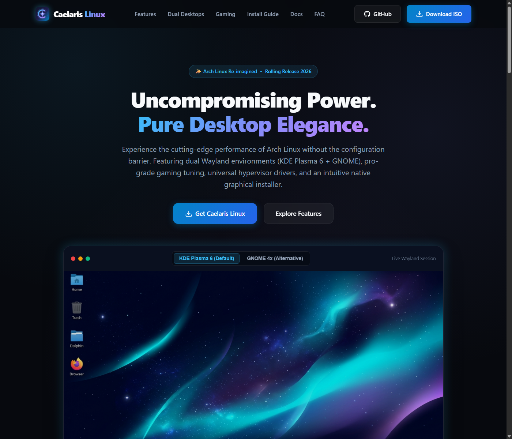

<p align="center">
  
</p>

<h1 align="center">Caelaris Linux</h1>

<p align="center">
  <strong>Next-Generation Arch-Based Operating System for High-Performance Gaming, Productivity & Modern Hardware</strong>
</p>

<p align="center">
  <a href="https://github.com/kurokai-kun/caelaris-linux/releases"></a>
  <a href="https://archlinux.org"></a>
  
  
  
</p>

---

## 🌌 Overview

**Caelaris Linux** is a modern, rolling-release operating system built upon the rock-solid foundation of Arch Linux. Engineered for enthusiasts, gamers, creators, and developers, Caelaris delivers out-of-the-box hardware acceleration, low-latency responsiveness, and a unified dual-desktop experience across modern x86_64 PCs and ARM64 devices.

<p align="center">
  
</p>

---

## ⚡ Key Highlights

### 🎨 Dual Desktop Experience in One System
* **KDE Plasma 6 & GNOME 4x Included**: Both premier desktop environments come pre-installed. Select your preferred environment directly from the modern SDDM login screen at any time.
* **Zero Application Clutter**: Intelligent desktop filtering ensures KDE-specific apps don't clutter your GNOME launcher, and GNOME utilities don't clutter your KDE launcher.
* **Modern Wayland by Default**: Ultra-smooth animations, fractional scaling, and multi-monitor variable refresh rate (VRR) support.

### 🎮 High-Performance Gaming & Low-Latency Tuning
* **Low-Latency Scheduling & Responsiveness**: Dynamic kernel preemption and real-time process priority dispatching (`rtkit`) ensure competitive input responsiveness.
* **Memory & Storage Optimization**: Pre-configured `vm.max_map_count=2147483642` eliminates crashes and allocation bottlenecks in modern DirectX 12, Unreal Engine 5, and Proton/Wine gaming titles.
* **ZRAM with zstd Compression**: High-speed memory compression prevents out-of-memory slowdowns and eliminates disk-thrashing hitches during heavy gameplay.
* **GameMode Pre-Integrated**: Automatically sets CPU governors to peak performance, boosts GPU frequencies, and isolates background processes when launching games.
* **Cutting-Edge Graphics Pipeline**: Ships with the latest Mesa Vulkan drivers (including ACO shader compilation for AMD, Turnip for Snapdragon Adreno, and Apple AGX for Apple Silicon) plus Wayland direct tearing protocol support.

### 💿 Custom Graphical Installer (`caelaris-installer-gui`)
* **Modern Glassmorphic Wizard**: Fast, intuitive installer built with Python 3 and PyQt6.
* **Smart Btrfs Layout**: One-click automatic partitioning with subvolumes (`@`, `@home`, `@snapshots`) and zstd transparent compression for instant rollbacks and disk savings. Standard Ext4 is also available.
* **Architecture-Aware Bootloader**: Automatically provisions EFI system partitions for both standard x86_64 UEFI and ARM64 fallback (`BOOTAA64.EFI`).

### 💻 Multi-Architecture Hardware Support
* **x86_64 Flagship**: Optimized for modern gaming PCs, Intel/AMD custom rigs, and laptops.
* **ARM64 Laptops & PCs**: Native support for Apple Silicon Macs (M1/M2/M3/M4 via UTM & Asahi) and Qualcomm Snapdragon X Elite Copilot+ laptops.
* **Raspberry Pi & SBCs**: Dedicated builds for Raspberry Pi 5, 4, and 3B+.
* **Cloud & Server Editions**: Lean, headless images with Cloud-Init automation for hypervisors, VPS, and homelabs.

---

## 📥 Downloads & Official Releases

All release images are generated via automated, transparent GitHub Actions CI workflows.

| Edition | Target Hardware | Format | Download |
| :--- | :--- | :--- | :--- |
| **Flagship Edition** | Standard 64-bit PCs & Laptops (Intel / AMD) | Hybrid ISO (UEFI & BIOS) | [Download (x86_64)](https://github.com/kurokai-kun/caelaris-linux/releases/tag/rolling-release) |
| **ARM64 Laptop & PC** | Snapdragon X Elite Copilot+ PCs & Apple Silicon (UTM / Asahi) | Multi-part Hybrid ISO | [Download (ARM64 PC)](https://github.com/kurokai-kun/caelaris-linux/releases/tag/arm64-pc-release) |
| **Raspberry Pi** | Raspberry Pi 5, 4, 400 & 3B+ | Raw Disk Image (`.img.xz`) | [Download (RPi)](https://github.com/kurokai-kun/caelaris-linux/releases/tag/rpi-arm64-release) |
| **Cloud Edition** | Proxmox, OpenStack, KVM/QEMU, AWS EC2, Hetzner | Cloud-Init ISO | [Download (Cloud)](https://github.com/kurokai-kun/caelaris-linux/releases/tag/cloud-release) |
| **Server Edition** | Bare-metal & Virtualized Headless Servers | Minimal CLI ISO | [Download (Server)](https://github.com/kurokai-kun/caelaris-linux/releases/tag/server-release) |

> [!NOTE]
> For multi-part ISO releases (e.g. ARM64 Laptop & PC), download all part files and run `combine.bat` on Windows or `cat caelaris-*.iso.part-* > caelaris.iso` on macOS/Linux.

---

## 🚀 Quick Installation Guide

### 1. Create a Bootable Drive
Write the downloaded ISO image to a USB flash drive (minimum 8 GB recommended):
* **Recommended Utility (Cross-Platform)**: [Ventoy](https://www.ventoy.net/) (simply copy the `.iso` file onto the drive).
* **Alternative (Windows)**: [Rufus](https://rufus.ie/) (select *DD Image mode* if prompted).
* **Alternative (Linux / macOS)**:
  ```bash
  sudo dd if=caelaris.iso of=/dev/sdX bs=4M status=progress oflag=sync
  ```

### 2. Boot & Explore
1. Insert the USB drive and boot your computer (access your BIOS/UEFI boot menu via `F12`, `F11`, `F10`, or `Del`).
2. Select **Caelaris Linux** from the bootloader menu.
3. The live environment will load into an interactive live session. Feel free to test your hardware, Wi-Fi, display, and audio.

### 3. Launch the Installer
1. Click **Install Caelaris Linux** on the desktop.
2. Follow the setup wizard to choose your storage drive, partition layout (Btrfs or Ext4), username, and primary desktop session.
3. When the installation finishes, reboot and remove your USB installation drive.

---

## 🔒 Security & Privacy by Design

* **100% Open Source & Auditable**: Built transparently in public GitHub Actions environments.
* **Zero Telemetry**: No user tracking, behavioral analytics, or background data collection.
* **Clean State Guarantee**: Live build processes purge machine-specific identifiers (`/etc/machine-id`) and host SSH keys, ensuring unique, secure keys are generated on each user's machine at first boot.
* **Cryptographic Verification**: Every release includes official SHA256 checksums to verify download integrity before flashing.

---

## 🛠️ Building from Source

Caelaris Linux images can be built automatically via GitHub Actions or locally in an Arch Linux environment:

```bash
# Clone the repository
git clone https://github.com/kurokai-kun/caelaris-linux.git
cd caelaris-linux

# Make build scripts executable
chmod +x scripts/*.sh

# Build the Flagship ISO locally (requires Arch Linux with archiso installed)
sudo ./scripts/build_flagship.sh
```

---

<p align="center">
  <sub>Caelaris Linux is developed and maintained by the Caelaris Community. Built with Arch Linux.</sub>
</p>